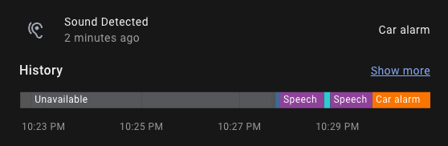

# AudioClassifier-MQTT

Use the [yamnet](https://tfhub.dev/google/yamnet/) TensorFlow model to classify live audio from a microphone and publish the predicted results to [Home Assistant](https://www.home-assistant.io/) via MQTT

## Configuration

Open `config.py` and set the following variables:

* __MQTT_HOST__: MQTT server hostname
* __MQTT_PORT__: MQTT server port
* __MQTT_USER__: MQTT server username _(optional)_
* __MQTT_PASS__: MQTT server password _(optional)_
* __HA_SENSOR_NAME__: Home Assistant sensor name
* __HA_SENSOR_UUID__: Home Assistant sensor UUID
* __HA_SENSOR_EXPIRE_AFTER__: How many seconds until Home Assistant considers the data to be stale
* __TF_MODEL__: TensorFlow model filename
* __TF_NUM_THREADS__: TensorFlow number of threads
* __TF_SCORE_THRESHOLD__: TensorFlow minimum score
* __TF_MAX_RESULTS__: TensorFlow maximum results
* __LOG_LEVEL__: Logging level
* __LOG_FORMAT__: Logging format
* __LOG_COLORS__: Logging level colors

## Usage

Check your Python version and make sure version 3.9 or newer is installed on your system:

```shell
$ python3 --version
```

Install required python3 modules:

```shell
$ pip3 install tflite_support
```

On Linux, install the PortAudio library:
```shell
$ sudo apt-get update && apt-get install libportaudio2
```

Run the `listen.py` script to start listening to the microphone and publishing the data to the MQTT server:
```shell
$ python3 ./listen.py
```

The sensor is now available in Home Assistant and can be used to trigger automations:



## License

Copyright (C) 2022 Sam Steele. Licensed under the Apache License, Version 2.0 (the "License"); you may not use this file except in compliance with the License. You may obtain a copy of the License at

http://www.apache.org/licenses/LICENSE-2.0

Unless required by applicable law or agreed to in writing, software distributed under the License is distributed on an "AS IS" BASIS, WITHOUT WARRANTIES OR CONDITIONS OF ANY KIND, either express or implied. See the License for the specific language governing permissions and limitations under the License.
